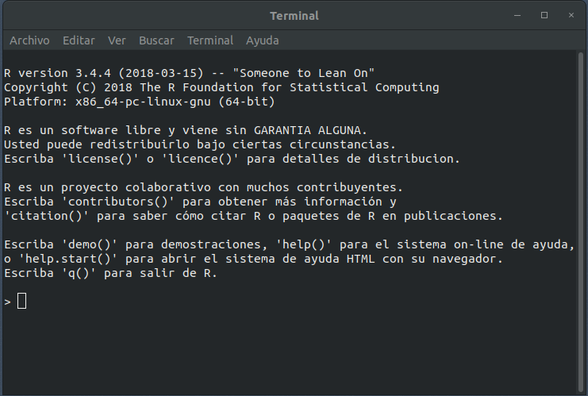

---
output:
  pdf_document: default
  html_document: default
---
# Introducción {#intro}

Antes de comenzar tú viaje a través del lenguaje de programación R, necesitaras cuatro "herramientas" básicas para trabajar con este apunte, R (lenguaje), Rstudio(IDE^[*Integrated Development Environment*]), una megalibrería que contiene *R packages* llamada *tidyverse* y librerías extras para trabajar en finanzas^[Estas librerías las iremos cargando/utilizando a medida que avancemos en los capítulos].

## R

### Un poco de historia
R es un lenguaje de programación creado por Ross Ihaka y Robert Gentleman del departamento de estadística de la universidad de Auckland en 1992 (Nueva Zelanda), teniendo su versión estable el 29 de Febrero del 2000. 

### Los primeros pasos
El primer paso es descargar R, para esto debes ir a CRAN^[Existe otra distribución de R por parte del area de *open source* de Microsoft , la ventaja de MRAN es que si bien funciona con CRAN, su objetivo va más orientado a computación en paralelo (paralleling computing)], *comprehensive R archive network*. CRAN esta compuesto por un conjunto de *mirror servers* distribuidos alrededor del mundo y se usa para compartir los *R packages*. Como recomendación no elegir un *mirror* lejano a tú posición geográfica, por ende, usa [https://cloud.r-project.org](https://cloud.r-project.org) que los seleccionará automáticamente.

Como aún no instalas RStudio solo tendras el lenguaje, que puede ser ejecutado desde el *command Shell* o *prompt*, no obstante, esto es ineficiente desde el punto de vista que no tendrenmos todas las opciones que Rstudio nos entrega.

```{r fig1, message=FALSE,out.width="33.3%", fig.align='center',fig.cap="logo de R",echo = FALSE}
knitr::include_graphics("images/R_logo.png")
```

Si trabajas sin IDE veras algo como en la Figura \@ref(fig:fig2).

```{r fig2, message=FALSE,out.width="50%", fig.align='center',fig.cap="R desde la terminal",echo = FALSE}

```

Las versiones de R cambian una vez al año, y de 2 a 3 veces con cambios pequeños, por eso es una buena idea que mantengas actualizada tu versión.

## RStudio

¿Qué es una IDE? IDE es el acrónimo de  *Integrated Development Environment (Entorno de Desarrollo Integrado)*. Esto quiere decir que RStudio es una aplicación que nos entrega herramientas para hacer más fácil el desarrollo de proyectos usando R y  sobre todo cuando estemos trabajando con datos.

Para descargar e instalar Rstudio debes ir a [http//www.rstudio.com/download](http//www.rstudio.com/download) y seleccionar  *RStudio Desktop Open Source License* (gratuita) , cuando exista una actualización Rstudio te avisará. 

Si quedó todo bien instalado, cuando abras Rstudio deberías ver algo así:

```{r fig3, message=FALSE,out.width="50%", fig.align='center',fig.cap="Rstudio",echo = FALSE}
knitr::include_graphics("images/rstudio.png")
```

> IMPORTANTE: Si te aparece algún error durante este proceso, lo más probabable es que sea por alguna configuración de tu sistema operativo. En ese caso, la mejor manera de buscar una solución es copiar el error que arroja R, pegarlo en tu motor de búsqueda favorito y ver cómo alguien que se enfrentó a eso antes lo resolvió.

### Partes de RStudio

¿Para qué sirven estos paneles? Comentemos primero el panel de abajo a la derecha. Si te fijas, el panel tiene varias ventanas:

1. **Files** muestra el directorio (la carpeta) en la que te encuentras actualmente. En mi caso, no hay nada ahí porque por defecto RStudio me muestra el Escritorio (Desktop) y no tengo nada en él. Es posible que a ti te muestre otra carpeta (por ejemplo, Documentos).

2. **Plots** es el lugar donde aparecerán los gráficos que vayas creando. No hemos hecho ninguno por ahora, así que este panel también está vacío.

3. **Packages** muestra la lista de paquetes que tienes instalados en tu computador. Si recorres el panel verás que algunos tiene una marca al lado izquierdo. Eso quiere decir que el paquete está activo en ese momento (ya veremos cómo hacer eso). Solo los paquetes vinculados a R base se activan al abrir RStudio.

4. **Help**, como su nombre lo indica, es la pestaña en la que podemos encontrar ayuda. Si buscamos el nombre de un paquete o de una función, RStudio nos remitirá a la documentación asociada.

4. **Viewer** es el panel para ver contenido web generado por algún paquete de R (gráficos para la web o aplicaciones interactivas). Por el momento no lo utilizaremos.

El panel de arriba a la derecha, por su parte, contiene el historial de funciones que hemos ejecutado (History), la opción para generar conexiones a bases de datos externas (Connections) y el Environment. Este último panel es muy importante y entender lo que nos muestra es fundamental para comprender cómo funciona R.

## *Scripts*

El script podemos decir que es un cuarto panel^[El tercer panel es la consola], en donde escribiras tus códigos que queremos que ejecute R, para crear un script debes:

1. ir a `file > New File > R Script`
2. Otra forma es un atajo de teclado, `control + shift + n`  (Linux/Windows) y `comando + shift + n`  (Mac OS).
3. O bien ir a la barra superior de la ventana y seleccionar el tipo de archivo a trabajar.

## Proyectos

Una de las ventajas de RStudio es que permite crear "proyectos". Un projecto es un espacio o contexto de trabajo asociado a una carpeta en particular, en la que se guardan nuestro(s) script(s), archivos de datos, etc. Cuando creamos un proyecto en RStudio, se crea un tipo especial de archivo (.Rproj) que lo que hace es vincular todo lo que se encuentra dentro de esa carpeta. 

###¿Por qué esto es útil? 

Si parte de nuestro script, por ejemplo, implica abrir un archivo que está en la carpeta de nuestro proyecto, no necesito indicar en mi código toda la ruta del archivo: lo que hará RStudio será buscarlo en el entorno/carpeta del proyecto. Si movemos la carpeta a otro lugar de nuestro computador o la compartimos con otra persona, nuestro código seguirá funcionando, ya que el archivo .Rproj mantendrá todo unido. Si no creara un proyecto, tendría que indicar al inicio de mi script cuál es la ruta de la carpeta que ocuparé como espacio de trabajo. El problema de esa opción es que si muevo la carpeta o le cambio el nombre, tendría que volver a escribir la ruta para que todo funcione. Al crear un proyecto eso deja de ser una preocupación.

###¿Cómo crear un projecto? 

1. Puedes hacerlo desde el menú File > New Proyect.
2. Lo primero que nos pregunta es si queremos crearlo en una carpeta nueva o en una ya existente. Elegiremos esta vez una carpeta nueva, así que seleccionaremos New Directory.
3. La siguiente pregunta es qué tipo de proyecto queremos crear. En esta ocasión, elegiremos la primera: *New Project*.
4. Finalmente, le damos un nombre al proyecto y decidimos en qué parte de nuestro computador queremos que viva la carpeta que lo contiene.
5. Luego de apretar Create Project, RStudio se reinicia y se producen algunos cambios. El panel Files (abajo a la derecha) ahora nos muestra la carpeta de nuestro proyecto y el único archivo que hay en ella por ahora. Ese es el archivo mágico que mantiene unido todo lo que hay dentro de la carpeta. Cuando queramos volver a trabajar en nuestro proyecto, solo tenemos que abrir ese archivo.

> IMPORTANTE:  RStudio ejecuta sesiones independientes de R para cada proyecto. Es decir, si tuvieras otro proyecto abierto te aparecería otro ícono, con su respectivo nombre. Esto nos permite trabajar en dos proyectos en paralelo sin que se nos mezclen los objetos del entorno, el código, los archivos, etc. Cada cosa en su lugar.


## *Packages*

Cuando instalamos R por primera vez en nuestro computador, lo que estamos instalando es lo que se conoce como "R Base", es decir, los elementos centrales del lenguaje de programación. Una de las ventajas de R es que se trata de un lenguaje extensible: la propia comunidad de usuarios puede desarrollar nuevas posibilidades para utilizarlo. La manera de compartir estos nuevos desarrollos es a través de "paquetes", que incluyen, entre otras cosas, código y datos. Una analogía que se suele utilizar para explicar esto es que R Base es un teléfono celular tal como viene de fábrica y los paquetes las apps que descargamos para que tenga más funcionalidades.

Para usar las librerias ("packages") debemos usar el siguiente código:

```r 
# instala el package
install.packages("acá va el package")

# lo llama
library("acá va el package")
```

### *tidyverse*

**tidyverse** es un "megapaquete" que incluye otros paquetes en su interior. Todos los paquetes que conforman "el Tidyverse" comparten la misma visión sobre el trabajo con datos y la escritura de código. Viene a formar parte de la nueva forma de programar en R, cuyo enfoque es netamente en realizar Data Science. Algunas librerias relevantes son:

1. ggplot2: Esta librería te permite realizar graficos avanzados.
2. dplyr: Su objetivo es la manipulación de datos (filtrar, seleccionar, generar, renombrar,etc).
3. magrittr: Contiene la denominada *pipe* ( %>% ), se explicará más adelante
4. purrr: Para realizar iteraciones.
5. readr: Para cargar datos en csv, lo importante que los transforma en tibble. 

Para instalarlo basta escribir:

```r 
# instala el package
install.packages("tidyverse")

# lo llama
library("tidyverse")
```

Si te vas a la pestaña de *Packages* verás que estan seleccionadas aquellas librerias que se encuentran en el tidyverse.

## Ejemplo

En este ejemplo vamos a trabajar con `gapminder`, un paquete que contiene una parte de los datos de Gapminder, una base de datos que incluye información mundial sobre población, expectativa de vida, PIB per cápita y otros. Su autor, Hans Rosling, ha hecho varias charlas [TED](https://www.ted.com/playlists/474/the_best_hans_rosling_talks_yo) que vale la pena mirar.

Instalamos la librería 
```r
# instala el package
install.packages("gapminder")
```

Cargamos tanto `gapminder` como `tidyverse` 
```{r, message=FALSE} 
# lo llama
library("gapminder")
library("tidyverse")
```

Calculamos el promedio de la expectativa de vida para los continentes en el 2007:

```{r}
world.data <- gapminder

mean.lifeExp <- world.data %>% 
                filter(year == 2007) %>% 
                group_by(continent) %>%
                summarize(mean(lifeExp))
```

```r
mean.lifeExp
```

Lo visualizamos
```{r, echo = FALSE}
DT::datatable(mean.lifeExp) 
```


Construimos la base de datos y graficamos la evolución de la expectativa de vida para los países de America del Sur desde 1952 a 2007.
```{r}
world.data <- world.data %>% 
              filter(country %in% c("Argentina", "Bolivia", "Brazil", "Chile", "Colombia", "Ecuador", "Paraguay", "Peru", "Uruguay", "Venezuela"))

g1 <- ggplot(world.data) + geom_line(mapping = aes(year,lifeExp, colour= country), size = 1.2)
g1 <- g1 + theme_bw() + labs(title = "Expectativa de vida para America del Sur", subtitle = "Desde 1952 a 2007", colour = "") 
g1 <- g1 + xlab("Años") + ylab("Expectativa de vida")
g1 <- g1 + theme(legend.position="bottom") 
g1
```

Finalmente lo guardamos.
```{r, message=FALSE}
ggsave("Grafico.png")
```
